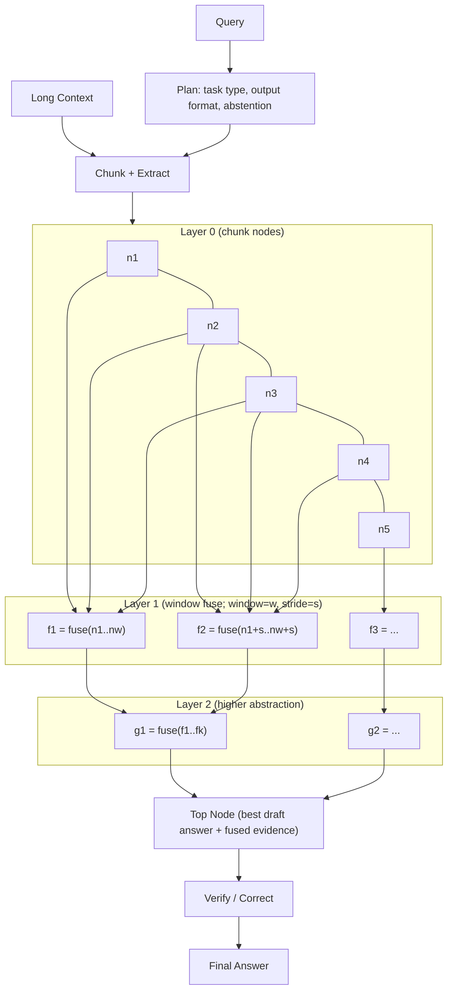

# Convolutional Context Propagation (CCP)

CCP uses a convolution-like pattern for LLM reasoning: each chunk is converted into a local evidence node, then sliding windows fuse neighboring nodes across layers (`window`, `stride`) to produce progressively more abstract and global answers.

CCP is a layered long-context reasoning pipeline that:
- chunks long context,
- extracts local evidence per chunk,
- fuses evidence across layers in convolution-style windows,
- verifies the final answer for support.

This repository is CCP-only (no RLM comparison code).

## Method

CCP (Convolutional Context Propagation) processes long context in four stages:

1. **Plan**
   - A planner predicts task guidance from the query (for example: task type, output format, abstention policy).
   - This guidance conditions all later steps.

2. **Chunk + Extract**
   - The context is split into overlapping chunks (`--chunk-chars`, `--chunk-overlap`).
   - For each chunk, an extractor returns:
     - a local candidate fragment,
     - key points/evidence spans,
     - a relevance/confidence signal.
   - CCP keeps higher-signal chunk nodes and discards empty/weak ones.

3. **Convolution-Style Fusion Across Layers**
   - Nodes are fused in sliding windows of size `--window` with movement `--stride`.
   - This is repeated for `--layers` rounds, progressively abstracting and consolidating information.
   - Each fusion step outputs a new node (draft answer + fused points + confidence), similar to hierarchical feature aggregation.

4. **Verification**
   - A verifier checks whether the selected draft answer is valid/supported.
   - If validation fails, it emits a corrected answer.

### Convolution + Abstraction Graph



### Why this helps on long context

- It avoids forcing one prompt to attend to the full document at once.
- It localizes evidence first, then propagates only compressed high-value signals upward.
- It gives explicit control over compute/quality trade-offs:
  - larger `window` or more `layers` => more aggregation capacity and cost,
  - smaller values => faster, cheaper inference.

### Signature Modes

- `adaptive` (default): task-aware QA signatures for general long-context benchmarks.
- `legacy`: memo-style/risk-style signatures for backward compatibility.

## CCP vs DSPy RLM

This repository focuses on CCP, but CCP is designed to be compared against DSPy RLM under matched settings.

### Conceptual Difference

| Aspect | CCP | RLM |
|---|---|---|
| Aggregation pattern | Fixed-depth convolution-style fusion over windows | Recursive reasoning / expansion |
| Main control knobs | `layers`, `window`, `stride`, chunking | recursion depth/branching style |
| Cost behavior | More predictable from fixed layer/window schedule | Can vary more with recursive branching |
| Typical strength | Stable local-to-global evidence compression | Flexible recursive decomposition |

### Fair Comparison Protocol

Use the same:
- dataset split,
- base model,
- decoding settings (temperature, max tokens),
- average token budget per query,
- judge and scoring method.

Report:
- quality (task metric or LLM-judge),
- latency,
- tokens/query and cost/query,
- win/tie/loss by sample.

## DSPy Implementation Snippet

```python
import dspy
from ccp.module import CPP

lm = dspy.LM("openai/gpt-4o-mini", temperature=0.0)
dspy.configure(lm=lm)

ccp = CPP(
    layers=2,
    window=2,
    stride=2,
    signature_mode="adaptive",
    enable_trace=True,
)

pred = ccp(
    context=long_context_text,
    query=user_query,
    chunk_chars=4000,
    chunk_overlap=400,
)

print(pred.answer)
print(pred.ccp_trace_json)  # intermediate layer trace
```

## Repository Layout

- `ccp/module.py`: `CPP` DSPy module.
- `ccp/signatures.py`: signature definitions (legacy/adaptive).
- `ccp/judge.py`: LLM-as-judge module.
- `ccp/io_utils.py`: JSONL and chunking utilities.
- `ccp/scoring.py`: scoring and evidence parsing helpers.
- `ccp/runner.py`: CLI runtime logic.
- `ccp/pipeline.py`: backward-compatible re-export layer.
- `scripts/run_ccp.py`: CLI wrapper for running CCP.
- `scripts/prepare_longbench.py`: converts raw LongBench task files into one eval JSONL.
- `configs/`: example command settings.
- `tests/`: lightweight non-API tests.

## Setup

```bash
python3 -m venv venv
source venv/bin/activate
pip install -r requirements.txt
cp .env.example .env
```

Set API key in your shell:

```bash
export OPENAI_API_KEY=your_key_here
```

## Data Preparation

Download and unpack LongBench:

```bash
mkdir -p data/benchmarks/longbench
curl -L -o data/benchmarks/longbench/longbench_data.zip \
  https://huggingface.co/datasets/THUDM/LongBench/resolve/main/data.zip
unzip -o data/benchmarks/longbench/longbench_data.zip -d data/benchmarks/longbench
```

Or with `wget`:

```bash
mkdir -p data/benchmarks/longbench
wget -O data/benchmarks/longbench/longbench_data.zip \
  https://huggingface.co/datasets/THUDM/LongBench/resolve/main/data.zip
unzip -o data/benchmarks/longbench/longbench_data.zip -d data/benchmarks/longbench
```

Place LongBench task files under:

`data/benchmarks/longbench/data/*.jsonl`

Then build a unified eval file:

```bash
python scripts/prepare_longbench.py \
  --longbench-dir data/benchmarks/longbench/data \
  --output-jsonl data/longbench_eval.jsonl \
  --max-total 500
```

## Run CCP

```bash
python scripts/run_ccp.py \
  --dataset-jsonl data/longbench_eval.jsonl \
  --limit 20 \
  --model openai/gpt-4o-mini \
  --ccp-signature adaptive \
  --progress-every 1 \
  --show-progress \
  --save-predictions artifacts/ccp_longbench_20.jsonl \
  --save-traces artifacts/ccp_traces
```

## Quick Sanity Test

```bash
python -m unittest discover -s tests -p "test_*.py" -v
```

## Notes

- `--ccp-signature legacy` is available for backward compatibility.
- `--cap-signature` is accepted as an alias to avoid breaking older scripts.
- LLM judge score is `0-10`; higher is better.
